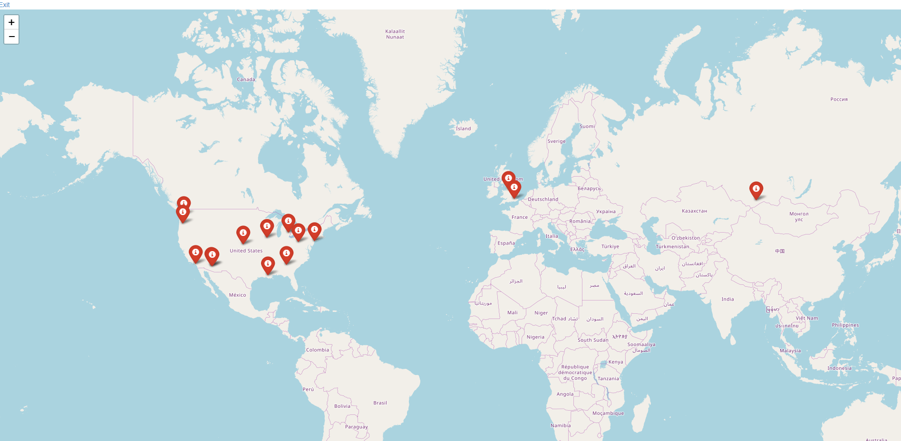
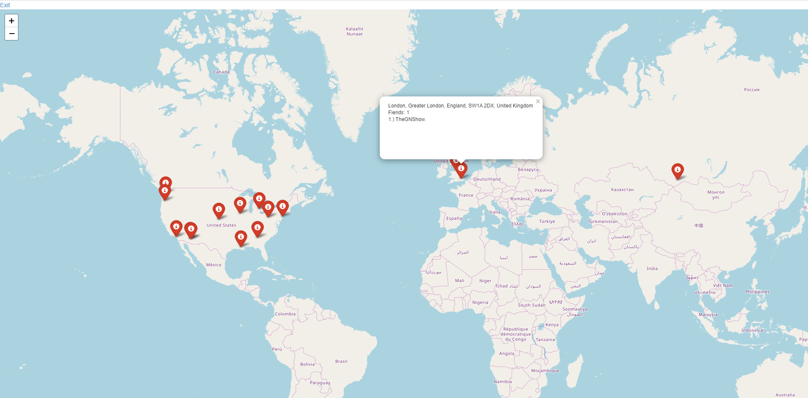

# Description
Nowadays, more and more people are getting used to socials networks, one of which is Twitter. It provides tones of information in one way or another. If we want to know a little more about somebody, we open one's profile and start searching for information. The inconvenience may be caused by the amount of information. In other words, it is really hard to find something specific without going through tremendous scopes of information. Therefore, it may be interesting for a twitter user to get information about his/her friends' followers and their locations. Using this web-application, anyone can do this.

To launch the application you need to download whole repository and run mini.py (do not forget to write your keys in access.py and move .html files to templates)
--------------------------------------------------------------------------------------------------------------------------------------
## Run examples

